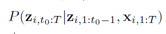
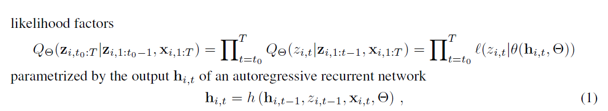
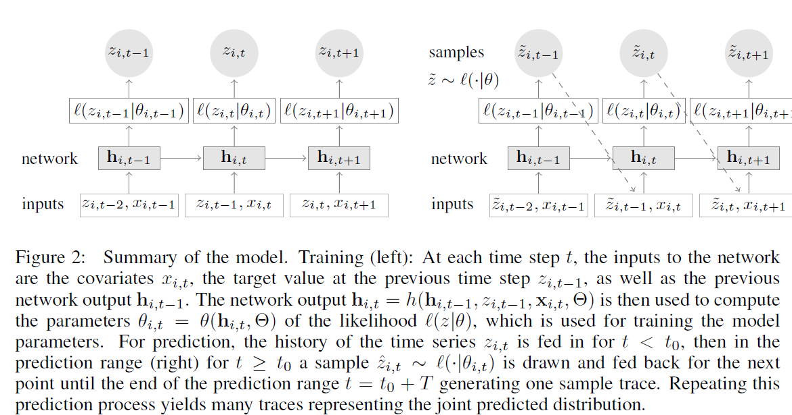

# DeepAR

[DeepAR: Probabilistic Forecasting with Autoregressive Recurrent Networks](https://arxiv.org/abs/1704.04110)

DeepAR, a methodology for producing accurate **probabilistic forecasts**, based on
training an **auto-regressive recurrent network model** on a large number of related
time series.

## Introduction
Using data from **related time series** not only allows fitting more complex (and hence potentially more accurate) models without overfitting, it can also alleviate the time and labor intensive manual feature engineering and model selection steps required by classical techniques.

Our method builds upon previous work on deep learning for time series data [9, 21, 22]

The main contributions:

(1)we propose an RNN architecture for probabilistic forecasting

(2)we demonstrate empirically on several real-world data sets that this model produces accurate probabilistic forecasts across a range of input characteristics

Key advantages:

(1)minimal manual feature engineering is needed to capture complex, group-dependent behavior

(2)can be used to compute consistent quantile estimates for all sub-ranges in the prediction horizon

(3)our method is able to provide forecasts for items with little or no history at all

(4)allow the user to choose one that is appropriate for the statistical properties of the data

## Model

Goal is to model the conditional distribution

From the picture we can know, in training, 

$$\(\sqrt{3x-1}+(1+x)^2\)$$